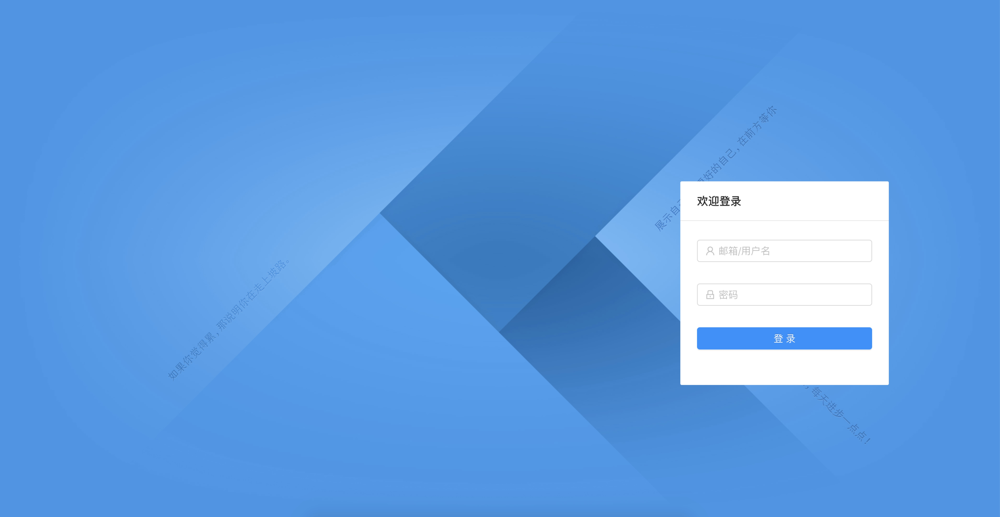
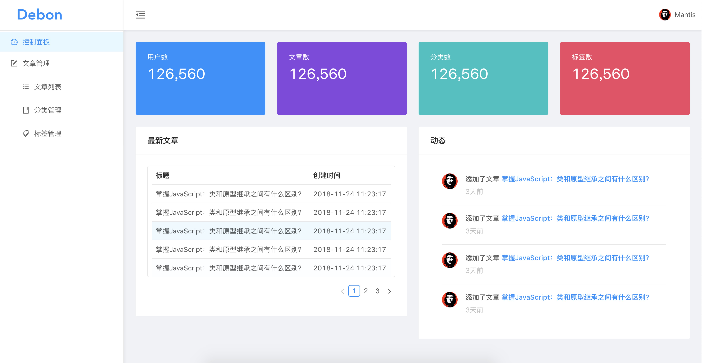

#### 截图

- 登录页

- 控制面板

#### 依赖工具

  - yarn/npm 

  - [React16](https://reactjs.org/)
  - [AntD UI](https://ant.design/index-cn)
  - [React-router-dom](https://www.npmjs.com/package/react-router-dom)
  - [axios HTTP Client](https://github.com/axios/axios)
  
#### TODO

- [x] 文章列表增加loading效果
- [x] 首页添加骨架屏效果
- [x] 错误/404页面
- [x] 登录功能实现
- [ ] 首页统计卡片加水印
- [ ] 侧边栏收缩功能
- [ ] 国际化 

...